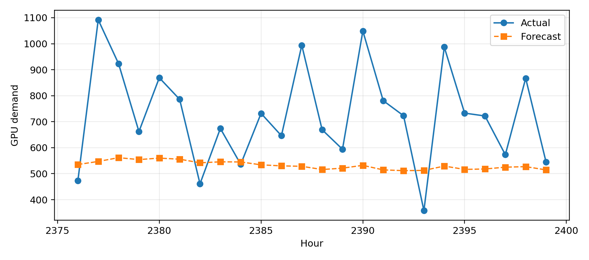
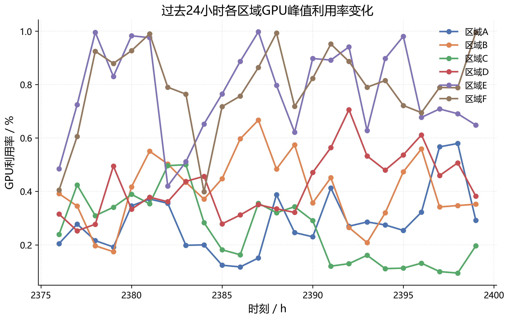
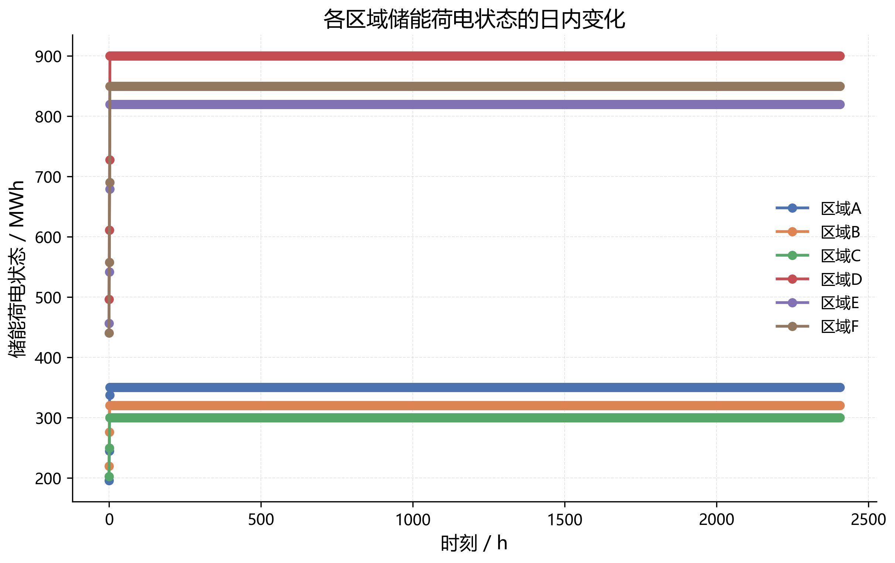
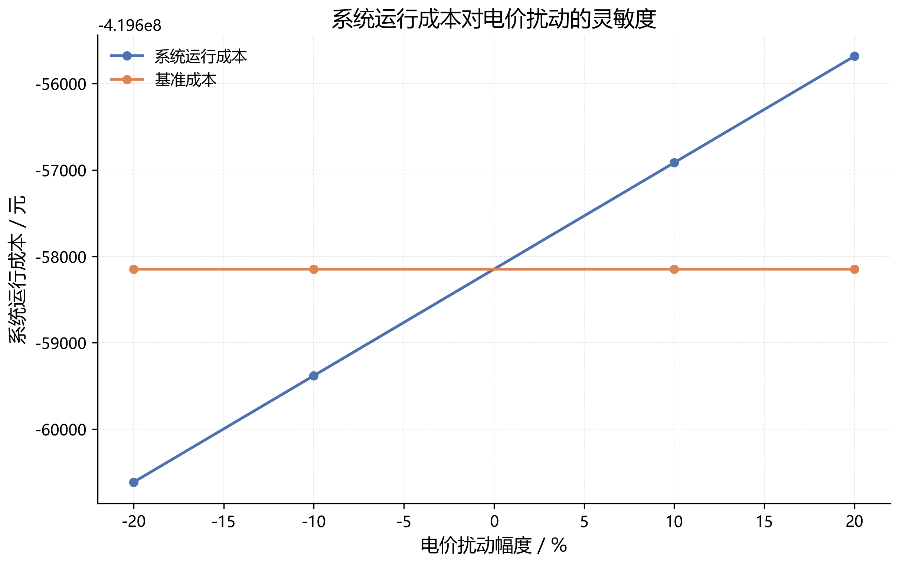
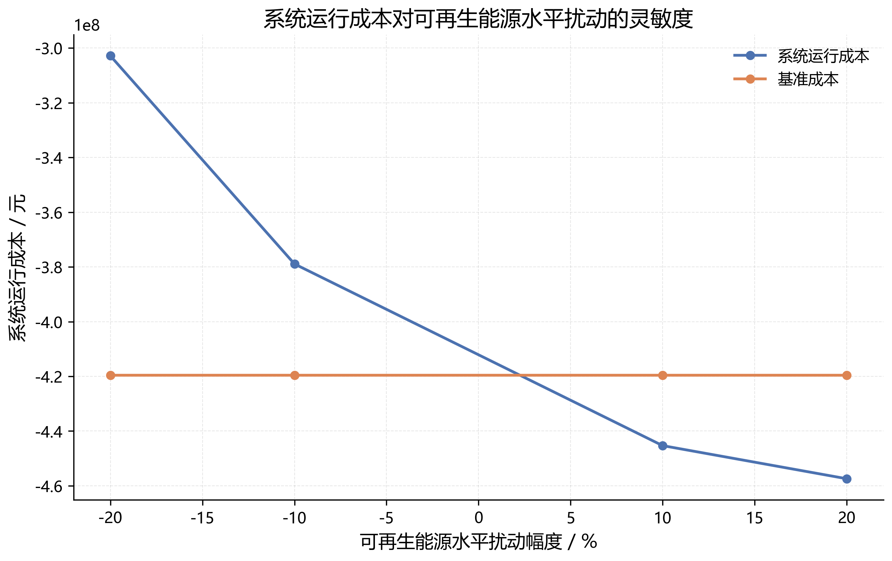

# 面向算电协同的多目标调度优化研究

> 题号：C。本文件是当前正式论文 `paper v21` 的 Markdown 阅读与协作副本；正式排版和提交版本仍为 `output/paper.pdf`。

## 摘要

针对六区域异构 AI 任务与新能源、储能、电网的耦合调度，本文构建“闭环需求预测—分层任务邻域—离散 SOC 动态规划—按情景交替搜索”的可复算框架。问题一在独立验证集上从季节朴素与 Huber 候选中选模，18 条序列中 17 条选择 Huber，平均 MAE、RMSE 和 WAPE 分别为 25.5892 GPU、34.5070 GPU 和 0.8231。问题二每个方向评价 10000 个候选；五维分层使单方案覆盖率达到 3.038%–3.616%，合计覆盖 16.148%；平衡方案成本为 $-4.213783\times10^8$ 元，碳排放 8.7569 tCO$_2$。问题三对不重复非支配方案统一采用加权理想点距离，选择成本策略，成本由 $-4.198203\times10^8$ 元降至 $-4.587522\times10^8$ 元，碳排放降至 0。问题四的联合基准与 17 个情景统一使用 21 个 SOC 状态；联合成本、碳排放和峰值购电分别为 $-4.587886\times10^8$ 元、0 tCO$_2$ 和 0 MW。两次独立运行的结果哈希和 Q1–Q4 语义一致。全部结论均为有限搜索 best-found 的场景可行结果，不构成全局最优或完整 Pareto 前沿。

**关键词：** 异构 AI 任务；闭环预测；算电协同；储能动态规划；多目标调度

---

# 问题重述

随着人工智能推理与训练任务持续增长，数据中心的算力分配已经与能源供给、碳排放和通信服务质量形成紧密耦合。题目给出了六个区域的 GPU 容量、IT 与设施功率边界、逐时非 AI 负荷、PUE、电价、碳强度、新能源出力、购售电限制、储能参数以及区域间单向网络时延，同时提供了三类异构 AI 任务的到达时刻、GPU 需求、预计持续时间、来源区域、最大允许时延和完成期限。需要在满足物理边界与服务约束的条件下，合理确定任务的执行区域和开工时刻，并协调新能源、储能及电网购售电行为。

整个运行过程具有明确的分层时间边界。第 $0$ 至第 $2399$ 小时构成任务到达主时域，第 $2400$ 至第 $2405$ 小时不再接收新任务，仅允许此前到达的弹性任务继续执行并完成结清；第 $2406$ 小时不得安排任何任务，只用于电力运行和储能终端状态结算。所有任务均不可拆分、不可抢占，也不得在执行过程中迁移。实时推理任务必须在到达时刻立即开工，批量推理与 AI 训练任务可以在允许范围内延迟，但其完成时点不得超过任务截止时间和系统统一终点。

对于问题一，需要按区域和任务类型统计 GPU 需求的规模、分布及时间规律，建立短期需求预测模型，并按照时间顺序完成模型训练、验证与最终测试。预测结果仅用于模型精度评价，最后 $24$ 小时的基础调度必须使用第 $2376$ 至第 $2399$ 小时的实际到达任务。调度时还需根据分钟级持续时间计算任务与各小时的真实重叠，据此分别审计瞬时 GPU 占用和小时电量，并展示任务实际起止时刻、执行区域及区域 GPU 利用情况。

对于问题二，需要使用全体实际任务和逐时电力参数重新构造碳感知调度方案。在任务唯一执行、实时任务即时开工、网络时延、GPU 容量、IT 功率、设施功率及完成时限均得到满足的基础上，系统运行成本、购电碳排放、有效网络时延和新能源利用率应被统一复算。问题二不配置储能，新能源被用于直接供能、区域外送或弃置，不足负荷由电网购电补足，且购电与售电行为必须服从区域边界及互斥要求。

对于问题三，任务调度结果不再作为决策变量，区域 AI IT 负荷被固定为附件中的基准负荷，区域设施负荷由基准 AI IT 负荷与非 AI IT 负荷之和乘以 PUE 得到。需要在储能初始状态、荷电状态递推、容量和功率边界、充放电互斥、购售电互斥以及终端能量不透支等条件下，确定逐区域逐时的充电、放电、购电、售电、新能源分配和弃电策略，并将含储能方案与无储能比较状态在成本、碳排放、峰值净购电功率和负荷爬坡方面进行比较。

对于问题四，需要把任务迁移与开工、设施负荷、新能源分配、储能运行以及购售电决策纳入同一框架，在运行成本、碳排放、网络时延、服务质量、新能源利用率和区域峰值净购电之间进行权衡。碳约束、电价机制与新能源波动等情景应从同一联合基准独立重构，并在相同任务集、容量边界、功率映射和评价口径下接受完整审计，从而辨析不同外部条件对任务迁移方向、执行窗口与能源行为的影响。

# 问题分析

本题同时包含任务级离散决策、分钟级连续占用和小时级能源结算。若把任务直接压缩为小时平均负荷，会漏掉只在小时内短暂重叠却造成瞬时 GPU 峰值的任务；若把所有触及某小时的任务都按整小时计费，又会高估 AI 电量。因此本文先保留任务的真实起止区间，再用"是否正重叠"审计瞬时容量，用"实际重叠时长"核算 GPU-hour 和电量，最后把重建负荷传给能源模型。

## 问题一：预测与末端调度分离

预测对象是区域---任务类型---小时的到达 GPU 需求。训练、验证、测试必须按时间顺序切分，且多步预测时后续滞后项只能使用此前预测值，不能回填测试真值。日周期与周周期朴素模型提供可解释基线，Huber 回归处理尖峰需求并通过验证集选择超参数(Huber 1964)。预测只用于精度评价；最后 24 小时调度仍读取第 2376 至 2399 小时实际到达的 538 个任务，从而避免"以预测量替代真实任务"的口径错误。

末端任务可能跨越第 2399 小时，因此调度时域延伸到第 2405 小时；第 2406 小时只用于能源和 SOC 结算。实时推理必须到达即开工，弹性任务可在到达与截止之间选择整数开工时刻。候选区域还需同时通过单向时延、GPU、IT 功率和设施功率下界筛选。

## 问题二：五个方向的有限任务邻域

全体 50000 个任务形成的区域---开工组合远超运行预算。本文不把"成本最小""碳最小"等命名误写成数学最优，而是令五个名称分别表示搜索优先方向：成本、碳、新能源、服务和平衡。每个方向按任务类型、来源区域、到达时段、GPUh 分位和等待分位确定性分层轮转，每任务最多评价 8 个移动候选，总预算仍为 10000；五个方向采用不同目标函数与遍历偏移。增量数组只更新受影响的区域和小时，但每个方向结束后仍对全部任务执行一次独立全量审计。这样既扩大不同任务覆盖，又把搜索效率与最终可信性分开。

系统净成本定义为购电支出减售电收入。题面售电边界较大，因此负成本只表示这一核算边界内售电收入超过购电支出。为揭示结果来源，除总成本外还分别报告购电量、售电量、购电支出和售电收入，不以单一负数掩盖现金流结构。

## 问题三：固定负荷下的离散 SOC 动态规划

本问固定附件中的基准 AI IT 负荷，任务调度不再变化。每个区域设置 21 个等距 SOC 状态，并显式加入真实初始 SOC；逐小时只枚举满足容量、充放电功率、购售电互斥、能量守恒和终端 SOC 等式的转移。候选集合必须包含 no-action，另外按成本、碳、新能源、峰值、爬坡和平衡六种偏好形成策略。相同轨迹按哈希去重后先做候选集内 Pareto 支配筛选，再对所有不重复非支配方案统一进行 min--max 标准化，以成本、碳、新能源、峰值、爬坡权重 $(0.30,0.25,0.15,0.15,0.15)$ 计算到理想点的加权距离；不按"平衡"等名称优先(Miettinen 1999)。

高循环策略可能在未计退化成本时获得较好账面指标。故等效循环次数是解释变量而非新的硬约束：本文如实报告成本最小、平衡和新能源优先策略的循环水平，并用终端 SOC 放宽实验区分"终端库存约束影响"与"策略本身改善"。

## 问题四：按情景动态重建邻域

联合问题中，任务方案改变设施负荷，储能轨迹又改变任务移动的边际电价和边际碳信号。固定若干预制任务方案再逐情景挑选，会切断这种反馈。本文对每个情景从共同任务基线和真实初始 SOC 独立重启：先求当前负荷下的储能，再依据该储能形成的价格、碳、购电和弃电信号重新生成 600 个任务候选；接受改进后重建下一轮邻域。最多 8 轮，连续 2 轮无改善即停止。

17 个情景覆盖基准、4 个碳约束水平、3 个峰谷价差、3 个售电机制、3 个新能源水平，以及种子 2026、2027、2028 的新能源波动。所有情景保持任务集、时域、PUE、功率映射和评价公式一致。碳目标未达到只能表述为"声明启发式内未达到"，不能据此推断数学不可行。

## 四问衔接与证据边界

四问共享任务重叠、设施负荷、能源守恒和审计函数，但不直接拼接决策结果。问题二以问题一可行基线启动；问题三独立使用题定固定负荷；问题四再以问题二平衡任务方案为共同基线，并用与联合解相同的 21 状态网格和同一储能策略重算全部情景。输出可信性来自结构化结果、逐行 CSV、完整约束审计和两次隔离复算。由于不存在独立 Oracle，最高可信等级限定为 scenario-feasible。

# 模型假设

为统一小时级调度与分钟级资源计量，假设任务开工时刻按照整数小时选取，而任务在各小时内的 GPU-hour 和能耗根据实际起止时刻与该小时的重叠时长计算。附件中的 GPU 需求、预计持续时间、到达时刻、来源区域、最大允许时延和最晚完成时刻均被视为准确且确定的输入参数，不另行建立执行时间和资源需求的随机模型。所有任务仅能选择一个执行区域和一个开工时刻，自开工至完成保持连续运行，不允许拆分、抢占、暂停或中途迁移。

假设实时推理任务必须在到达时刻立即开工，其执行区域只能从满足单向网络时延和资源容量的区域中选择。批量推理与 AI 训练任务可以延迟开工，但不得早于到达时刻，且必须在任务有效截止时点与系统时点 $2406$ 中较早者之前完成。第 $2400$ 至第 $2405$ 小时只用于此前到达弹性任务的结清，第 $2406$ 小时不产生任务资源占用，只承担电力与储能终端结算。

假设同一任务类型的单位等效 GPU 平均 IT 功率在研究期内保持为功率映射附件给定值，不随区域和时间改变。非 AI IT 负荷在各区域和各时段固定且不可迁移，只有 AI 任务负荷能够随执行区域及开工时刻改变。区域设施功率由 AI 与非 AI 合计 IT 功率乘以对应 PUE 得到，PUE 在研究期内按附件取值，不建立其随环境或负荷率变化的动态模型。

假设区域间通信只体现为附件给出的来源区域至执行区域单向网络时延，时延在研究期内确定且不受网络拥塞影响。来源区域与执行区域相同时仍采用时延矩阵中的对应记录，不自行设定为零。由于题面没有给出网络带宽、迁移数据量、传输能耗和传输费用等信息，上述因素不被纳入模型。

假设购电价格、售电价格、电网碳强度、可用新能源和固定负荷在单个小时内保持恒定。各区域逐小时独立满足能源平衡，不建立区域间线路潮流模型，区域售电被视为向系统边界外送。可用新能源可以被分配至直接供给负荷、储能充电、外送或弃电，其优先关系由实际策略与能源平衡共同确定，而不预设全部新能源均被本地直接消纳。运行碳排放仅按电网购电量与相应碳强度累计，不计新能源、储能设备和通信设施的生命周期排放。

假设储能在第 $0$ 小时运行前的状态唯一取自附件中的初始 SOC，后续状态均在该绝对值基础上递推，不将初始状态归零或作为待估参数。区域逐时基准 SOC 只用于方案核验与比较，不作为优化轨迹的固定约束。充电效率作用于进入储能的能量，放电效率作用于储能侧能量消耗，未给出的自放电与储能退化成本不予考虑。每个区域在第 $2406$ 小时运行后的 SOC 等于其初始 SOC，从而避免通过透支终端能量获得虚假的当期收益。

假设同一储能在同一小时只能处于充电、放电或空闲状态，不能同时充放电；区域购电和售电也不能在同一小时同时发生。两类行为均受附件所给功率上限约束，若价格和效率条件不能自然排除无效循环，则通过互斥状态约束加以限制。问题三中的 IT 负荷固定为基准 AI IT 负荷与非 AI IT 负荷之和，不重新调整任务的执行区域和开工时刻。

假设预测模型与正式调度严格分离，预测区间的估计值只用于测试精度评价，最后 $24$ 小时基础调度以及问题二至问题四的正式计算均使用实际任务和实际逐时参数。服务质量仅由题内可观测的即时开工、单向时延 SLA、按期完成情况及弹性任务等待时间表示，不引入用户满意度或可靠性等缺乏数据支持的变量。进行碳约束、电价机制与新能源波动情景比较时，除指定变化因素外，其余任务集、设备容量、网络时延、功率映射及评价公式均保持一致。

假设普通空白值在未经核验前均属于不可裁决缺失，不自动替换为零。只有在互斥进流与出流字段中，空白所在行为孤立事件、对应另一列明确非零，且备注、相邻记录和全表口径共同支持互斥解释时，才将其认定为结构零。经过处理的数据还应接受任务唯一执行、实时即时开工、时延与截止、GPU 和功率容量、能源守恒、SOC 递推、终端状态及购售电边界的统一审计。

# 符号说明

为避免符号表挤占正文并降低可读性，本文只列出后续推导反复使用的核心符号；仅出现一次的辅助量在公式后就地解释。任务、能源和评价指标分组列示，均采用模板默认正文字号。

## 任务、预测与容量符号

::: {#tab:symbol-task}
  符号                           含义                                           单位/类型
  ------------------------------ ---------------------------------------------- -----------
  符号                           含义                                           单位/类型
  $i,r,t,k$                      任务、区域、小时、任务类型索引                 索引
  $a_i,h_i,F_i$                  到达时刻、持续小时数、有效截止时点             h
  $g_i,o_i,k_i$                  GPU 需求、来源区域、任务类型                   GPU/类别
  $\ell_{o_ir},\ell_i^{\max}$    来源至执行区单向时延及任务上限                 ms
  $\omega_{it}(s)$               开工时刻为 $s$ 时，任务与小时 $t$ 的重叠时长   h
  $\chi_{it}(s)$                 任务在小时 $t$ 是否存在正重叠                  二元参数
  $\Omega_i$                     任务 $i$ 的合法区域---开工候选集合             集合
  $x_{irs}$                      任务是否在区域 $r$、时刻 $s$ 开工              二元变量
  $D_{rkt},\widehat D_{rkt}$     实际与预测的逐时到达 GPU 需求                  GPU
  $x_{rk,t}$                     Huber 模型的滞后量与周期特征向量               向量
  $G_r^{\max}$                   区域可调度 GPU 容量                            GPU
  $P_r^{IT,\max},P_r^{F,\max}$   区域 IT 与设施功率上限                         MW
  $p_k^{GPU}$                    任务类型单位 GPU 的平均 IT 功率                MW/GPU
  $\pi_r$                        区域 PUE                                       无量纲
  $L_{rt}^{N},L_{rt}^{BAI}$      非 AI 负荷与问题三固定 AI 基准负荷             MW
  $L_{rt}^{AI,avg},L_{rt}^{F}$   AI 小时平均负荷与设施负荷                      MW

  : 任务与预测核心符号
:::

## 电网、新能源与储能符号

::: {#tab:symbol-energy}
  符号                            含义                                      单位/类型
  ------------------------------- ----------------------------------------- -------------
  符号                            含义                                      单位/类型
  $R_{rt}^{av}$                   可用新能源功率                            MW
  $R_{rt}^{use},R_{rt}^{ch}$      新能源直接消纳与储能充电功率              MW
  $R_{rt}^{sell},R_{rt}^{curt}$   新能源外送与弃电功率                      MW
  $G_{rt}^{buy},G_{rt}^{sell}$    电网购电与系统边界外送功率                MW
  $I_r^{\max},X_r^{grid}$         区域最大购电与最大外送功率                MW
  $C_{rt},D_{rt}$                 储能充电与放电功率                        MW
  $S_{rt},S_r^0$                  时段末 SOC 与运行前初始 SOC               MWh
  $S_r^{min},S_r^{max}$           SOC 下限与上限                            MWh
  $C_r^{\max},D_r^{\max}$         最大充电与放电功率                        MW
  $\eta_r^c,\eta_r^d$             充电效率与放电效率                        无量纲
  $c_{rt}^{buy},c_{rt}^{sell}$    购电价格与售电价格                        元/MWh
  $\kappa_{rt}$                   电网购电碳强度                            tCO$_2$/MWh
  $N_{rt}$                        净购电功率 $G_{rt}^{buy}-G_{rt}^{sell}$   MW

  : 能源与储能核心符号
:::

## 评价与搜索符号

::: {#tab:symbol-metric}
  符号                                  含义                                     单位/类型
  ------------------------------------- ---------------------------------------- -----------
  符号                                  含义                                     单位/类型
  $C_{op}$                              购电支出减售电收入后的运行成本           元
  $E_{CO_2}$                            电网购电产生的累计碳排放                 tCO$_2$
  $U_{RE}$                              新能源有效利用率                         无量纲
  $L_{net}$                             GPU-hour 加权网络时延                    ms
  $Q_{service}$                         实时、按期和等待指标形成的服务质量       无量纲
  $P^{peak}$                            六区域非负峰值净购电功率之和             MW
  $V$                                   相邻小时净购电绝对变化量之和             MW
  $N^{cycle}$                           储能等效完整循环次数之和                 次
  $\Psi$                                有限候选比较使用的标准化代理分数         无量纲
  $\rho_C,\delta_P,\delta_S,\delta_R$   碳约束、峰谷价差、售电与新能源情景参数   无量纲

  : 评价指标与搜索符号
:::

其中 $\chi_{it}$ 与 $\omega_{it}$ 分别服务于瞬时容量和小时电量，二者不可互换；$U_{RE}$、$L_{net}$ 和服务质量只有在分母有效时才进入评价。完整实现中的辅助变量、状态哈希与停止计数见程序及结构化运行证据。

# 模型的建立与求解

## 统一时间、资源与能源口径

任务 $i$ 的 GPU 数、到达时刻、持续小时数和有效截止分别记为 $g_i,a_i,h_i,F_i$，其中 $h_i=d_i/60$，$F_i=\min\{l_i,2406\}$。任务在整数时刻 $s_i$ 开工，与小时区间 $[t,t+1)$ 的重叠量为 $$\begin{equation}
\omega_{it}=\max\{0,\min(t+1,s_i+h_i)-\max(t,s_i)\},\qquad
\chi_{it}=\mathbf 1\{\omega_{it}>0\}.
\end{equation}$$ $\chi_{it}$ 用于瞬时 GPU 与功率边界，$\omega_{it}$ 用于电量。合法候选集合满足 $$\begin{equation}
\Omega_i=\{(r,s):s\ge a_i,\ s+h_i\le F_i,\ \ell_{o_i r}\le \ell_i^{\max},\ \omega_{i,2406}=0\}.
\end{equation}$$ 每个任务恰选一个候选，实时任务还满足 $s_i=a_i$。区域 $r$ 在小时 $t$ 的 GPU、IT 与设施功率约束为 $$\begin{align}
\sum_i g_i\chi_{it}\mathbf 1(r_i=r)&\le \bar G_r,\\
L_{rt}^{N}+\sum_i g_i p_{k_i}^{GPU}\chi_{it}\mathbf 1(r_i=r)&\le \bar P_r^{IT},\\
\pi_r\!\left(L_{rt}^{N}+\sum_i g_i p_{k_i}^{GPU}\chi_{it}\mathbf 1(r_i=r)\right)&\le \bar P_r^{F}.
\end{align}$$ AI 平均负荷则以 $\omega_{it}$ 累计。运行成本、购电碳排放与新能源利用率统一为 $$\begin{align}
C&=\sum_{r,t}(c^{buy}_{rt}G^{buy}_{rt}-c^{sell}_{rt}G^{sell}_{rt}),\\
E&=\sum_{r,t}\kappa_{rt}G^{buy}_{rt},\\
U&=\frac{\sum_{r,t}(R^{use}_{rt}+R^{ch}_{rt}+R^{sell}_{rt})}{\sum_{r,t}R^{av}_{rt}},
\end{align}$$ 其中 $U$ 仅在分母为正时计算。网络时延按任务 GPU-hour 加权，服务质量由实时 SLA、按期完成率和等待统计共同解释。

## 问题一：严格闭环预测与基础调度

### 候选预测模型与选模

对区域 $r$、任务类型 $k$ 的到达 GPU 序列 $D_{rkt}$，Huber 候选使用滞后 $1,2,3,24,48,168$ 及日、周正余弦特征。其损失为 $$\begin{equation}
\min_{b,\theta,\sigma>0}n\sigma+\sigma\sum_t\rho_{\epsilon}\!\left(\frac{D_{rkt}-b-x_t^\mathsf T\theta}{\sigma}\right)+\alpha\|\theta\|_2^2.
\end{equation}$$ 其特征向量明确写为 $$\begin{equation}
\begin{aligned}
x_{rk,t}=\big[&D_{rk,t-1},D_{rk,t-2},D_{rk,t-3},D_{rk,t-24},D_{rk,t-48},D_{rk,t-168},\\
&\sin(2\pi t/24),\cos(2\pi t/24),\sin(2\pi t/168),\cos(2\pi t/168)\big]^{\mathsf T}.
\end{aligned}
\end{equation}$$ 短滞后捕捉临近惯性，24 小时与 168 小时滞后分别对应日、周重复结构，正余弦项避免把周期边界处理成跳变。

超参数网格为 $\epsilon\in\{1.10,1.35,1.75\}$、$\alpha\in\{10^{-4},10^{-3},10^{-2}\}$，并与 24 小时、168 小时季节朴素模型比较。第 0 至 2351 小时训练，第 2352 至 2375 小时验证，第 2376 至 2399 小时测试。验证阶段按 RMSE、MAE、WAPE 和固定模型次序破除并列；测试阶段闭环递推，字段 `FeatureUsesTestTruth` 全为 false。

::: {#tab:q1model}
  模型                 MAE/GPU   RMSE/GPU     WAPE
  ------------------ --------- ---------- --------
  24 小时季节朴素      35.3032    46.9509   1.0809
  168 小时季节朴素     35.9120    46.9954   1.2171
  验证集选定模型       25.5892    34.5070   0.8231

  : 问题一最终测试的模型比较（18 条序列指标取平均）
:::

::: {#tab:q1type}
  任务类型     平均 MAE/GPU   平均 RMSE/GPU   平均 WAPE
  ---------- -------------- --------------- -----------
  实时推理           3.1140          4.3412      0.8465
  批量推理          12.7318         16.9469      0.7328
  AI 训练           60.9217         82.2330      0.8899

  : 验证选模后按任务类型汇总的测试误差
:::

AI 训练的绝对误差最高，原因是单任务 GPU 规模和尖峰幅度显著大于推理任务；实时推理绝对误差较小，但因真实需求基数较低，WAPE 并未同步降到最低。故三项指标必须联合解释，不能以单一 WAPE 判断容量调度风险。选定的 17 个 Huber 模型覆盖多组 $\epsilon$ 与 $\alpha$：其中 $\epsilon=1.75,\alpha=10^{-4}$ 出现 6 次，其余组合分散出现，说明逐序列验证选择并非退化为单一公共参数。

18 条序列中 17 条选择 Huber，RegionC 的实时推理选择 168 小时季节朴素。相对两条朴素基线，验证集选定模型的平均 MAE 至少下降 27.5%，说明独立验证选模在本测试窗口内有效；但这只是一次保留测试，不代表长期泛化误差。将 18 条序列聚合后的逐小时预测与真实值见图 [1](#fig:q1forecast){reference-type="ref" reference="fig:q1forecast"}。

<figure id="fig:q1forecast" data-latex-placement="H">

<figcaption>第 2376 至 2399 小时聚合 GPU 需求：预测与真实值</figcaption>
</figure>

### 538 个实际任务的末端调度

最后 24 小时不用预测需求，而使用 538 个实际到达任务。确定性可行构造依次按实时属性、截止、持续时间、GPU 需求和任务编号排序，再按等待、时延和新增峰值利用率选择候选。共有 68 个任务在第 2400 至 2405 小时完成，且第 2406 小时任务占用为零。峰值利用率与按重叠时间折算的平均利用率分别为 $$\begin{equation}
U^{peak}_{rt}=\frac{\sum_i g_i\chi_{it}\mathbf 1(r_i=r)}{\bar G_r},\qquad
U^{avg}_{rt}=\frac{\sum_i g_i\omega_{it}\mathbf 1(r_i=r)}{\bar G_r}.
\end{equation}$$ 图 [2](#fig:gpu){reference-type="ref" reference="fig:gpu"} 来自 solve v13 的逐时图形数据，完整调度表接受任务唯一性、时窗、时延和三类容量全量审计。

<figure id="fig:gpu" data-latex-placement="H">

<figcaption>最后 24 小时各区域 GPU 利用率</figcaption>
</figure>

## 问题二：五方向增量任务搜索

问题二不启用储能。逐时能源满足 $$\begin{align}
R^{use}_{rt}&=\min\{R^{av}_{rt},L^F_{rt}\},\\
G^{buy}_{rt}+R^{use}_{rt}&=L^F_{rt},\\
R^{use}_{rt}+R^{sell}_{rt}+R^{curt}_{rt}&=R^{av}_{rt},
\end{align}$$ 且购售电互斥并受进出口上限约束。对某个任务移动，只重算原执行区、新执行区及任务占用小时上的 GPU、IT、设施功率和能源数组；若任一硬边界失败，候选立即淘汰。通过增量检查后，根据搜索方向构造分数：成本方向优先降低净成本，碳方向优先降低购电碳排放，新能源方向优先减少弃电，服务方向优先减少时延与等待，平衡方向同时考虑上述变化。只有严格改善才更新 incumbent。

该增量过程不替代最终验证。每个方向结束后重新从任务表构造全部区域---小时数组，并对 50000 个任务执行完整审计。每个搜索方向以同一可行任务方案为起点，按五维分层轮转并完整评价 10000 个候选；单任务最多评价 8 个候选，"方向名"仅说明候选排序准则。

::: {#tab:q2schemes}
  方向       成本/亿元      碳/t   新能源率   时延/ms   迁移数   接受数
  -------- ----------- --------- ---------- --------- -------- --------
  成本         -4.2030   13.8001   0.679290    5.2880      434      515
  碳           -4.1966   14.3916   0.679078    5.1594      209        0
  新能源       -4.2087   14.9419   0.679585    6.1123     1397     1608
  服务         -4.1966   14.3916   0.679078    5.1585      206        3
  平衡         -4.2138    8.7569   0.679760    6.2016     1342     1503

  : 问题二五类有限搜索结果
:::

平衡方向被用于后续联合基线。五次搜索共评价 50000 个候选，每个方向均对 50000 个任务执行一次全量审计。单方案任务覆盖率为 3.038%--3.616%，五方案合计覆盖 16.148%，均超过预设的 2% 和 10% 门槛。平衡方案的服务质量为 0.963633，最大等待为 219 小时；这说明代理评分仍允许以等待损失换取其他指标。

::: {#tab:q2cost}
  方向       购电/MWh       售电/MWh   购电支出/万元   售电收入/亿元   净成本/亿元
  -------- ---------- -------------- --------------- --------------- -------------
  成本        39.3516   1331969.3746          1.1873          4.2031       -4.2030
  碳          40.4664   1329591.2956          1.2328          4.1967       -4.1966
  新能源      41.4158   1334262.9499          1.2742          4.2089       -4.2087
  服务        40.4664   1329590.2461          1.2328          4.1967       -4.1966
  平衡        20.3496   1336197.1677          0.7097          4.2139       -4.2138

  : 问题二成本现金流分解
:::

表 [7](#tab:q2cost){reference-type="ref" reference="tab:q2cost"} 说明负成本几乎完全由售电收入驱动。

平衡方案相对于未搜索基线把净成本由 $-4.196581$ 亿元降至 $-4.213783$ 亿元，碳排放由 14.3916 降至 8.7569 tCO$_2$；它是有限候选集中的 best-found 折中结果，不构成跨方案 Pareto 最优。5000 与 10000 候选两档实验中，各方向成本相对变化不超过 0.183%，但接受数和覆盖率仍增长，说明结果方向稳定而搜索尚未完全收敛。

## 问题三：离散 SOC 动态规划与候选筛选

设施负荷固定为 $L^F_{rt}=\pi_r(L^{BAI}_{rt}+L^N_{rt})$。令 $S_{rt}$ 为时段末 SOC，充放电功率为 $C_{rt},D_{rt}$，则 $$\begin{align}
S_{rt}&=S_{r,t-1}+\eta_r^cC_{rt}-D_{rt}/\eta_r^d,\\
S_r^{min}\le S_{rt}&\le S_r^{max},\qquad S_{r,2406}=S_r^0.
\end{align}$$ 每区使用 21 个等距状态并额外加入 $S_r^0$。设 $\mathcal S_r$ 为离散状态集合，$\phi_t(s,s')$ 为从 $s$ 转移至 $s'$ 时对应策略的单步代价，则动态规划递推为 $$\begin{equation}
J_t(s')=\min_{s\in\mathcal S_r:\,(s,s')\ \text{可行}}\{J_{t-1}(s)+\phi_t(s,s')\},
\qquad J_{-1}(S_r^0)=0.
\end{equation}$$ 可行转移由充放电功率、购电上限与能源守恒共同决定；正式方案终点固定为 $S_r^0$。成本策略取购电支出减售电收入，碳策略放大购电碳排放，新能源策略主要惩罚弃电，峰值策略使用购电平方，爬坡策略惩罚相对参考购电的绝对变化，平衡策略组合成本、碳、弃电和购电平方。逐时保留最优前驱并在终点回溯完整 SOC 轨迹。

峰值、爬坡和等效循环定义为 $$\begin{equation}
P=\sum_r\max\{0,\max_t(G^{buy}_{rt}-G^{sell}_{rt})\},\quad
V=\sum_{r,t}|N_{rt}-N_{r,t-1}|,
\end{equation}$$ $$\begin{equation}
N^{cycle}=\sum_r\frac{\sum_t(C_{rt}+D_{rt})}{2(S_r^{max}-S_r^{min})}.
\end{equation}$$

::: {#tab:q3policies}
  策略          成本/亿元      碳/t   新能源率     唯一轨迹
  ----------- ----------- --------- ---------- ----------------
  no-action       -4.1982    8.8506   0.679150        是
  成本            -4.5875    0.0000   0.711735        是
  碳              -4.1990    0.0000   0.679300        是
  新能源          -4.5856    4.6997   0.771475        是
  峰值            -4.1990    0.0000   0.679300  否（同碳策略）
  爬坡            -4.1982   11.4975   0.679305        是
  平衡            -4.5858    0.2241   0.771439        是

  : 问题三七策略的经济、碳与新能源指标
:::

::: {#tab:q3operation}
  策略          峰值/MW   爬坡/MW   等效循环   候选内非支配
  ----------- --------- --------- ---------- --------------
  no-action     31.5979   63.1957      0.000             否
  成本           0.0000    0.0000    240.186             是
  碳             0.0000    0.0000      2.146             否
  新能源         2.7455   15.2020   1568.882             是
  峰值           0.0000    0.0000      2.146             否
  爬坡          40.9020   81.8040      2.496             否
  平衡           0.3740    0.7480   1568.242             是

  : 问题三七策略的峰值、爬坡与循环指标
:::

统一加权理想点规则在三个不重复非支配策略中给出的距离分别为：成本 0.387298、平衡 0.486182、新能源 0.921954，故选择成本策略，而非按名称优先平衡策略。相对 no-action，其成本减少 38931829.24 元，碳排放减少 8.8506 tCO$_2$，峰值与绝对爬坡均降至 0；累计充、放电分别为 216984.58 MWh 和 189681.13 MWh，等效循环合计 240.186。图 [3](#fig:soc){reference-type="ref" reference="fig:soc"} 显示终端 SOC 回到初始值。

<figure id="fig:soc" data-latex-placement="H">

<figcaption>问题三统一折中规则所选成本策略的六区域 SOC 轨迹</figcaption>
</figure>

成本策略的等效循环虽低于平衡和新能源策略的 1500 以上，240.186 次仍反映未计退化成本时的频繁利用。它不违反题面给定硬约束，但会削弱工程可实施性；因此本文只把该轨迹称为理想设备下的候选集内非支配方案。终端 SOC 放宽实验下，各区终端值降至 35、32、30、90、82、85 MWh，而成本最小策略的成本与强制回到初值时相同，说明当前成本最小候选的结果并非由终端库存被迫抬高造成。

## 问题四：任务---储能动态交替搜索

联合模型用真实任务轨迹重建 $L^F_{rt}$，并继承前三问全部任务、能源和 SOC 约束。联合基线从问题二平衡任务方案出发，储能侧仍从真实初始 SOC 重启。联合基准与全部情景显式绑定同一成本策略和 21 状态 SOC 网格。结构化一致性门禁确认两者逐指标相同：成本 $-458788576.53$ 元，碳排放 0 tCO$_2$，网络时延 6.201629 ms，服务质量 0.963633，新能源利用率 0.711406，峰值购电 0 MW，不再存在未标注的 15/21 状态双基准。

每轮联合评价使用七维向量 $$\begin{equation}
\mathbf z=(C,E,-U,P,V,L_{net},\overline W),
\qquad
\Psi(\mathbf z)=\frac{1}{7}\sum_{j=1}^{7}\frac{z_j-z_j^0}{\max(|z_j^0|,1)}.
\end{equation}$$ 若设置碳目标且候选超过目标，程序按超额比例加入显式罚项。这样可避免亿元级成本在未经尺度化时压倒碳、峰值和服务指标；同时，罚项只用于声明启发式的候选排序，不能转化为不可行性证明。

实际交替过程如下。

1.  对当前任务方案重建逐时设施负荷，并求离散 SOC 储能策略；

2.  由当前电价、碳强度、购电和弃电形成任务移动信号；

3.  按固定次序评价 600 个任务移动候选，只接受通过增量边界的严格改进；

4.  对候选执行 50000 任务全量审计，若接受则以新任务与新储能作为下一轮 incumbent；

5.  达到 8 轮上限或连续 2 轮无改善时停止；每个情景独立重启。

基准情景完成 2 轮、评价 1200 个候选且未接受轮次；新能源水平 0.8 情景完成 5 轮、接受 3 轮并评价 3000 个候选；其余情景均完成 2 轮。所有情景合计 37 轮、22200 个候选。

轮次审计区分"局部移动改善"和"整轮联合接受"：只有储能重建后的七维联合分数严格改善才更新 incumbent。基准、碳、电价和售电情景均在连续两轮无整轮改善后停止；新能源水平 0.8 的三次整轮接受表明邻域会随前一轮储能信号重建，而不是从固定候选表中挑选。完整逐轮轨迹保留在结构化证据中。

::: {#tab:q4scenarios}
  水平          轮数   迁移数   成本/亿元     碳/t   新能源率   峰值/MW
  ----------- ------ -------- ----------- -------- ---------- ---------
  基准             2     1342   -4.587886   0.0000   0.711406    0.0000
  削减 0.00        2     1342   -4.587886   0.0000   0.711406    0.0000
  削减 0.10        2     1342   -4.587886   0.0000   0.711406    0.0000
  削减 0.20        2     1342   -4.587886   0.0000   0.711406    0.0000
  削减 0.30        2     1342   -4.587886   0.0000   0.711406    0.0000

  : 基准与碳约束情景
:::

::: {#tab:q4price}
  类型       系数     轮数   迁移数   成本/亿元   新能源率   峰值/MW
  ---------- ------ ------ -------- ----------- ---------- ---------
  峰谷价差   0.75        2     1342   -4.587886   0.711406    0.0000
  峰谷价差   1.00        2     1342   -4.587886   0.711406    0.0000
  峰谷价差   1.25        2     1342   -4.587886   0.711406    0.0000
  售电机制   0.00        2     1342    0.000000   0.679913    0.0000
  售电机制   0.50        2     1342   -2.293943   0.711406    0.0000
  售电机制   1.00        2     1342   -4.587886   0.711406    0.0000

  : 电价与售电机制情景
:::

::: {#tab:q4renewable}
  类型   水平/种子     迁移数   成本/亿元       碳/t   新能源率    峰值/MW
  ------ ----------- -------- ----------- ---------- ---------- ----------
  水平   0.80            1434   -3.951679   912.3805   0.860891   233.6284
  水平   1.00            1342   -4.587886     0.0000   0.711406     0.0000
  水平   1.20            1342   -4.593414     0.0000   0.579184     0.0000
  波动   2026            1342   -4.545083   597.8699   0.710964   263.0643
  波动   2027            1342   -4.543701   636.6865   0.710946   292.4869
  波动   2028            1342   -4.546611   333.5577   0.711208   131.0484

  : 新能源水平与波动情景
:::

21 状态成本策略的统一基准购电碳排放已经为 0，故四个碳约束水平都满足目标且不再出现"声明搜索内未达到"。售电系数主要改变净成本，新能源水平和波动则同时改变碳排放与峰值购电，说明新能源不确定性仍是联合运行的主要敏感源。

## 统一约束审计与方法边界

任务审计逐项检查唯一执行、实时即时开工、到达、截止、单向时延、第 2406 小时禁占用、GPU、IT 和设施功率。能源审计检查 $$\begin{align}
e^{energy}_{rt}&=G^{buy}_{rt}+R^{av}_{rt}+D_{rt}-L^F_{rt}-C_{rt}-G^{sell}_{rt}-R^{curt}_{rt},\\
e^{SOC}_{rt}&=S_{rt}-S_{r,t-1}-\eta_r^cC_{rt}+D_{rt}/\eta_r^d.
\end{align}$$ 只有最大残差、互斥、功率边界与终端等式全部通过才写出正式结果。

#### 实现边界 D1

Q2 与 Q4 是预声明候选预算内的 best-found 可行解，不是穷举最优解。

#### 实现边界 D2

Q3 使用 21 个 SOC 网格状态，未计题面未给出的退化成本与循环寿命上限。

#### 实现边界 D3

Q4 的随机波动只使用固定种子 2026、2027、2028，并逐情景独立重启。

#### 证据边界 L1

无独立 Oracle，最高可信等级为 scenario-feasible。

#### 证据边界 L2

候选集内非支配不等于完整决策空间的 Pareto 前沿。

#### 证据边界 L3

Q2 方案名表示搜索方向，不表示跨方案的对应目标最小值。

# 模型检验与灵敏度分析

## 硬约束、复算与双运行

solve v13 的约束审计显示：任务唯一性、到达、截止、实时开工、时延、GPU、IT 与设施功率均通过；Q3 和 Q4 的能源平衡、SOC、功率、互斥及终端状态最大绝对残差不超过 $1.137\times10^{-13}$。这些检验说明结果在给定容差与题面参数内自洽，但不提供最优性证书。

两次隔离运行使用相同输入、同一 code v16 与固定种子，自然耗时分别为 754.37 s 和 793.71 s，输出文件数均为 53。`results.json` 的 SHA-256 同为 `377f0fc8...759956`；Q2、Q3、Q4 结构化语义及去除 run ID、真实耗时后的运行合同完全一致。仅三份包含实测耗时的文件字节不同。

## 问题二参数灵敏度

以平衡方案成本 $-421378290.28$ 元为基准，对购电价格整体缩放。系数为 0.8、0.9、1.1、1.2 时，成本分别为 $-421379709.76$、$-421379000.02$、$-421377580.54$、$-421376870.80$ 元，相对变化绝对值不超过 0.000337%。图 [4](#fig:price){reference-type="ref" reference="fig:price"} 表明当前净成本对购电价格整体缩放不敏感，原因是购电支出相对售电收入很小。

<figure id="fig:price" data-latex-placement="H">

<figcaption>问题二净成本的购电价格灵敏度</figcaption>
</figure>

新能源水平系数为 0.8、0.9、1.1、1.2 时，成本分别为 $-3.046617$、$-3.806991$、$-4.462847$、$-4.576383$ 亿元，相对基准变化为 27.6988%、9.6539%、$-5.9107$%、$-8.6051$%。图 [5](#fig:renewable){reference-type="ref" reference="fig:renewable"} 呈现明显非线性：新能源下降时购电缺口扩大，而上升时外送上限与弃电共同限制边际收益。

<figure id="fig:renewable" data-latex-placement="H">

<figcaption>问题二净成本的新能源水平灵敏度</figcaption>
</figure>

## 终端 SOC 与高循环策略解释

15、21、31 个 SOC 状态下，统一所选成本策略的成本分别为 $-4.583249$、$-4.587522$、$-4.590387$ 亿元；21 相对 31 状态的成本误差为 0.0624%，新能源利用率误差为 0.0547%，且三组约束残差均不超过 $1.137\times10^{-13}$。对应等效循环为 247.737、240.186、231.961。题面未给退化成本与循环上限，故这些高吞吐轨迹只表示理想设备情景可行。

Q4 三个新能源波动种子的峰值购电为 131.0484--292.4869 MW、碳排放为 333.5577--636.6865 tCO$_2$，显示单一随机轨迹不足以概括风险；当前三种子只提供方向性稳健性证据。

# 模型评价与推广

## 模型优点

模型对四问采用同一数据口径：瞬时 GPU 容量按任务重叠计算，小时电量按持续时间分摊，避免平均负荷掩盖峰值。Q1 严格按训练、验证、闭环测试排序，并保留季节朴素基线；Q2 将增量候选评价与 50000 个任务的全量审计分开；Q3 强制保留 no-action、对轨迹去重；Q4 在每轮储能更新后重建任务邻域。这些设计分别控制了数据泄漏、搜索成本、基线缺失和"伪联合优化"风险。

五个任务方案、七个储能策略和 17 个联合情景均有逐行结构化结果，硬约束残差通过；两次隔离运行的结果哈希及 Q2--Q4 语义一致。因此结论可复算，并达到当前证据边界下的 scenario-feasible。

## 模型不足

Q2 每个方向只检查 10000 个单任务移动，虽单方案覆盖超过 3%、五方案合计超过 16%，仍未穷尽任务---时空组合；Q4 每轮只检查 600 个候选并最多运行 8 轮，二者均没有全局最优证书。Q3 的 21 状态 SOC 离散也只给出网格内候选。储能模型未计退化、自放电和备用容量，部分策略等效循环超过 1500，故账面收益不能直接解释为可部署收益。负成本主要来自题面边界内售电收入高于购电支出，也不表示全生命周期成本为负。

通信侧仅使用静态单向时延，未纳入带宽、拥塞和迁移能耗；最大等待仍可达到 219 小时，说明综合服务指标不能替代任务级尾部检查。统一 21 状态基准下碳排放为 0 只说明题面边界和当前候选允许该结果，不代表生命周期零碳。当前 benchmark 又无独立 Oracle，约束通过和双运行只能证明内部一致与可重复，不能证明外部真实最优。

## 推广方向

后续应优先扩大 Q2/Q4 邻域或引入混合整数规划上界，并沿用同一全量审计；Q3 可加入每 MWh 吞吐退化成本、年度循环上限并做网格加密。在线场景可采用滚动时域：逐小时更新任务、新能源和价格预测，冻结已开工任务并传递绝对 SOC，这与模型预测控制一致(Rawlings et al. 2017)。多目标部分可用 $\varepsilon$-约束法扩充非支配候选(Miettinen 1999)，但仍须区分"候选内非支配"和"已证 Pareto"。

# 参考文献

:::::: {#refs .references .csl-bib-body .hanging-indent}
::: {#ref-huber1964robust .csl-entry}
Huber, Peter J. 1964. "Robust Estimation of a Location Parameter." *The Annals of Mathematical Statistics* 35 (1): 73--101. <https://doi.org/10.1214/aoms/1177703732>.
:::

::: {#ref-miettinen1999nonlinear .csl-entry}
Miettinen, Kaisa. 1999. *Nonlinear Multiobjective Optimization*. Springer. <https://doi.org/10.1007/978-1-4615-5563-6>.
:::

::: {#ref-rawlings2017model .csl-entry}
Rawlings, James B., David Q. Mayne, and Moritz M. Diehl. 2017. *Model Predictive Control: Theory, Computation, and Design*. 2nd ed. Nob Hill Publishing.
:::
::::::

---

## 版本说明

- 数值来源：`solve v13`。
- 论文来源：`paper v21`。
- 评审来源：`review v15`。
- 可信等级：`scenario-feasible`。
- Markdown 便于阅读和协作，不替代 LaTeX/PDF 的正式版式。
